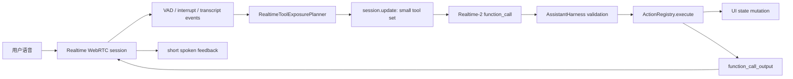

# Realtime-2 Voice Agent Optimization Plan

## 目标

把小桌板语音助手从“语音转写后交给本地文本链路处理”升级为真正的 Realtime-2 语音助理：

- 用户可以自然对话、快速得到短反馈。
- 用户说话时可以打断正在播报或正在执行的流程。
- Realtime-2 能基于当前桌面状态选择合适工具和参数。
- 所有工具调用最终仍经过本地 Harness、确认策略、ActionRegistry 和 UI 状态验证。
- 测试必须覆盖真实语音链路，避免再次出现“700 命令测试通过，但实际语音无效”。

## 官方文档和案例依据

- OpenAI Realtime 模型文档强调 `gpt-realtime-2` 适合低延迟语音、推理、短反馈、工具调用和长会话状态；工具使用要有清晰 prompt、明确调用边界、必要参数收集和工具结果处理。参考：<https://developers.openai.com/api/docs/guides/realtime-models-prompting/>
- OpenAI WebRTC 文档说明浏览器/PWA 语音场景应使用 Realtime WebRTC 连接，并通过 data channel 交换 Realtime events。参考：<https://developers.openai.com/api/docs/guides/realtime-webrtc/>
- Realtime conversations/function calling 文档要求应用侧执行工具，并把工具结果写回会话，让模型继续响应。参考：<https://developers.openai.com/api/docs/guides/realtime-conversations/>
- VAD 文档覆盖语音分段、语义 VAD、打断和 turn detection 调优。参考：<https://developers.openai.com/api/docs/guides/realtime-vad/>
- `openai-realtime-agents` 展示了 Realtime voice agent、工具、handoff、supervisor 和 guardrails 的组合模式。参考：<https://github.com/openai/openai-realtime-agents>
- `openai-realtime-meeting-assistant` 展示了通过 Realtime + WebRTC + function calling 用自然语音直接更新 Kanban board 的模式。参考：<https://github.com/openai/openai-realtime-meeting-assistant>

## 当前偏差

`agent.md` 原计划是：

1. 本地高置信 shortcut 先执行。
2. Realtime-2 看到全能力目录摘要。
3. Realtime-2 选择模块、目标和工具。
4. 前端通过 `session.update` 只加载相关模块的工具 schema。
5. Realtime-2 发出 function call。
6. Harness 校验参数、绑定目标、处理确认、执行工具。
7. 工具结果回传给 Realtime-2，模型继续短反馈或追问。

实际实现已经偏成：

```text
Realtime audio session
-> only assistant.execute_command
-> model returns command text
-> local Harness parses/executes
```

这条路径稳定性较高，但没有充分发挥 Realtime-2 的工具选择、参数抽取、会话状态和 function calling 能力。它也解释了为什么文字可以执行、语音容易无效：文字和语音没有始终进入同一个动态工具选择和 Harness 执行链路。

## 目标架构



关键原则：

- Realtime-2 不再只做转写，也不直接绕过 Harness 修改 UI。
- 本地不让 Realtime-2 一次看到所有工具，只暴露当前最可能需要的候选工具。
- 其他工具通过能力目录可发现，但只有在模块/目标被选中后才变成可执行 schema。
- 本地 Harness 是唯一执行边界。
- 所有失败都必须有结构化 trace，而不是 UI 上“没反应”。

## 工具暴露策略

### 常驻工具

Realtime session 初始只常驻少量导航工具：

- `assistant.select_intent`: 选择模块、意图、目标提示和置信度。
- `assistant.ask_clarification`: 信息不足时追问。
- `assistant.cancel_current_task`: 用户打断或取消当前任务。
- `assistant.plan_complex_command`: 多模块、多步骤或低置信命令进入深度规划。

不要把 `music.play`、`note.write`、`todo.clear_completed`、`clipboard.clear` 等细节工具放进初始 session。

### 能力目录

Realtime-2 必须能发现所有已实现且允许的能力，但目录只放摘要：

```text
music: 播放、搜索、暂停、关闭音乐窗口；aliases=音乐/播放器/歌曲
weather: 设置城市、查看天气、关闭天气窗口；aliases=天气/气温/城市
note: 写便签、追加、清空、关闭窗口；risk=清空需要确认
todo: 添加待办、完成待办、清空已完成；risk=清空需要确认
```

目录不可执行，只用于选择模块和候选工具。

### 本地候选器

新增 `RealtimeToolExposurePlanner`，由本地确定性规则生成候选工具：

```ts
type RealtimeToolExposurePlan = {
  input: string;
  selectedModules: string[];
  exposedTools: AssistantToolSpec[];
  scopedContexts: RealtimeScopedModuleContext[];
  reasons: Record<string, string[]>;
  excludedReasons: Record<string, string>;
  confidence: number;
};
```

输入：

- 用户语音 transcript 或文本。
- 当前 `CompactAssistantContext`。
- `WidgetAssistantRegistry.getRealtimeCatalog()`。
- 当前 `currentTools` / `ToolScopeManager`。
- 当前 focus、mounted widgets、available definitions、pending confirmation。
- 工具 risk、requiresTarget、requiresAuth、requiresPermission、concurrencyKey。

候选打分：

```text
+40 用户文本命中模块别名
+30 命中工具例句或 shortcutExamples
+25 当前桌面已有对应 widget
+20 当前 focusedWidget 匹配
+20 工具 risk=safe
+15 参数可从用户话里提取
-30 destructive 工具，除非用户明确说删除/清空
-40 requiresTarget 但找不到实例且不能 board.add_widget
-50 权限、认证或 mounted capability 不可用
```

限制：

- 单模块命令最多暴露 4-6 个工具。
- 多模块命令每个模块最多暴露 3 个工具。
- 总工具数最多 12 个。
- destructive 工具默认不暴露，除非用户明确请求，并且执行时仍必须 preview/confirm。

示例：

```text
用户：我想听王菲的歌
候选：music.play, music.search, board.add_widget, widget.focus
排除：weather.set_city=module_mismatch, note.write=module_mismatch, clipboard.clear=destructive_not_requested
```

### 多步命令

对“播放王菲，再把天气切到上海，然后记一条便签”这类命令：

1. selector 返回 `music`, `weather`, `note`。
2. 本地暴露每个模块的 Top 工具和必要共享工具。
3. Realtime-2 可以连续调用多个 function call。
4. Harness 根据 `dependsOn`、`concurrencyKey` 和资源冲突决定串行或并行。
5. 某一步失败时把工具结果回传，让 Realtime-2 修正、追问或停止。

## 打断和短反馈

Realtime-2 不能等所有工具完成后才说话。语音体验要求：

- 工具调用前先给非常短的 preamble，例如“我来处理”。
- 用户插话时立即取消当前 response，清理当前候选工具状态。
- 打断后重新基于最新 transcript 建立候选工具集合。
- 如果旧工具调用已经发出但还没执行，Harness 要能标记为 cancelled 或 stale。

每条命令必须记录：

```text
speech_started
speech_stopped
input_transcript.delta/final
session.updated
function_call
function_call.arguments
harness.route
tool.exposed
tool.selected
tool.result
function_call_output
assistant_audio/text
ui.operation
```

## 实施阶段

### Phase 1: 统一入口和 trace

- 语音、文字、transcript fallback 最终都进入 `AssistantHarness.handleRealtimeUserInput` 或等价统一入口。
- 删除“文字能 shortcut、语音只 execute_command”的路径差异。
- 为每条语音命令生成同一个 `commandTraceId`。
- UI 不能只显示“没反应”，必须显示失败层级。

验收：

- 10 条真实语音 smoke 每条都有完整 trace。
- 空 command、空 transcript、无 function call、Harness reject 都能被区分。

### Phase 2: 恢复动态工具暴露

- 引入 `RealtimeToolExposurePlanner`。
- 初始 Realtime session 从 `assistant.execute_command` 单入口改为 selector + 目录摘要。
- 在模块/目标选中后通过 `session.update` 暴露 scoped tools。
- `assistant.execute_command` 只作为降级 fallback，不作为主路径。

验收：

- `关闭留言板` 暴露 `widget.remove`，并绑定 `widgetId` 后执行。
- `我想听王菲的歌` 暴露 `music.play/music.search/board.add_widget/widget.focus`。
- `上海天气` 暴露 `weather.set_city/board.add_widget/widget.focus`。
- 每个暴露工具都有 reasons，每个未暴露工具有 excluded reason。

### Phase 3: Realtime function call 执行闭环

- Adapter 监听 Realtime function call。
- Harness 校验、执行，并发送 `function_call_output`。
- Realtime-2 根据工具结果继续短反馈或追问。
- destructive/confirm 路径必须进入 preview/confirm。

验收：

- 工具结果能回传 Realtime。
- Realtime 不因 missing widgetId 编造参数。
- `board.add_widget -> followUp` 能被稳定执行。

### Phase 4: 复杂命令和打断

- 支持多模块计划。
- 支持 response cancel 和候选工具重建。
- VAD eagerness 按场景调优：默认 `medium`，长句场景 `low`，命令模式 `high` 或 `auto` 试验。

验收：

- “播放王菲，再查上海天气” 至少执行两个工具。
- 用户中途说“算了，记个待办”时，旧响应停止，新任务执行。

## 最佳测试方式

### 为什么旧 700 会漏掉真实语音失败

旧测试主要覆盖：

```text
文本/模拟 transcript
-> semantic contract 或 mocked plan
-> Harness execution
-> in-memory state / partial real-page checks
```

真实语音链路是：

```text
麦克风
-> WebRTC
-> VAD
-> Realtime session.update
-> function_call
-> data channel
-> Harness
-> UI
```

所以 700 通过只证明文本命令和 Harness 大体可用，不证明麦克风、VAD、session tools、function call、tool output、打断和真实 UI 反馈可用。

### 新测试金字塔

#### 1. Unit: ToolExposurePlanner

对 700 条命令生成候选工具快照。

验收：

- expected tool 必须在 exposedTools 中，或者有明确 fallback reason。
- forbidden tool 不得出现在 exposedTools 中。
- destructive 工具只有明确删除/清空语义才可暴露。
- 每个暴露/排除决策都有 reason。

命令：

```bash
pnpm --filter @xiaozhuoban/web test -- src/assistant/realtimeToolExposurePlanner.test.ts
```

#### 2. Contract: Realtime semantic gate

继续运行在线 Realtime-2 semantic gate，但新增校验：

- Realtime 选中的工具必须属于本地 exposedTools。
- 如果 Realtime 返回 non-action tool，本地 recovery 必须有 trace。
- semantic pass 不能冒充 execution pass。

命令：

```bash
XIAOZHUOBAN_REALTIME_LIVE_SITE=https://xiaozhuoban.bqxb.org node scripts/realtime-live-semantic-gate.mjs --catalog --limit=700 --batch-size=12
```

#### 3. Stateful Harness 700

保留现有主执行门禁：

```bash
pnpm --filter @xiaozhuoban/web test -- src/assistant/voiceScenarioCatalogStatefulHarness.test.ts
```

新增要求：

- 输入应经过 ToolExposurePlanner 产出的候选工具。
- 不允许测试直接给一个全局 mocked plan 绕过候选工具阶段。
- target-required 工具必须到执行时拥有真实 `widgetId` 或进入 intentional clarification。

#### 4. Real-page execution probes

继续保留 `scripts/playwright-real-page-*-group.js`，但每个报告必须标注：

- live Realtime-2 parsing
- mocked Realtime plan
- local shortcut
- transcript fallback

不能把 mocked plan 的 UI 成功记为 live Realtime-2 成功。

#### 5. Live voice smoke 10

新增最高优先级门禁，先跑 10 条，不追求 700 全量音频：

```text
1. 关闭留言板
2. 打开音乐播放器
3. 我想听王菲的歌
4. 暂停音乐
5. 上海天气
6. 打开便签
7. 帮我记一下今天测试语音
8. 十分钟后提醒我
9. 打开电视然后全屏
10. 关闭所有小工具
```

每条必须真实经过：

```text
microphone/audio input
-> WebRTC Realtime session
-> VAD/transcript/function_call
-> Harness
-> UI state mutation
```

验收标准：

- 10/10 有 `speech_started` 和 final transcript。
- 10/10 有 session tools trace。
- 8/10 以上必须产生 function_call；允许少量 transcript fallback，但必须有明确原因。
- 10/10 必须有 Harness result。
- 10/10 成功或 intentional clarification，不允许 silent no-op。
- 每个失败必须归类到具体层级。

失败分类：

```text
audio_permission_denied
vad_not_triggered
transcript_empty
session_update_missing
tool_exposure_missing
function_call_missing
function_call_empty_arguments
harness_rejected
tool_execution_failed
tool_output_not_returned
ui_state_not_changed
stale_response_after_interrupt
```

#### 6. Live voice interrupt smoke

至少 3 条：

```text
1. 用户说“播放王菲”，助手开始处理后用户打断“算了，打开天气”
2. 用户说“关闭所有小工具”，确认前说“取消”
3. 用户说“打开电视然后全屏”，中途说“不，全屏音乐”
```

验收：

- 旧 response 被 cancel。
- 旧候选工具被丢弃。
- 新 transcript 重新触发 ToolExposurePlanner。
- 旧工具调用不应落到 UI，除非已经执行且 trace 标注不可撤销。

## 发布门禁

Realtime 改造不能只看 700 是否通过。每次合并前必须满足：

```bash
pnpm --filter @xiaozhuoban/assistant-core test
pnpm --filter @xiaozhuoban/web test -- src/assistant/AssistantHarness.test.ts src/assistant/openaiRealtimeAdapter.test.ts src/assistant/realtimeTextToolCall.test.ts
pnpm --filter @xiaozhuoban/web test -- src/assistant/voiceScenarioCatalogStatefulHarness.test.ts
pnpm --filter @xiaozhuoban/web typecheck
git diff --check
```

并额外提交两份报告：

- `docs/realtime-live-voice-smoke-report.md`
- `docs/realtime-tool-exposure-700-report.md`

没有真实语音 smoke 通过，不得声称“语音命令修复完成”。没有 700 stateful 通过，不得声称“广度回归完成”。

## 成功定义

改造完成后，下面这些说法必须同时成立：

- 用户真实语音说 10 条核心命令，页面确实变化或给出明确确认/澄清。
- Realtime-2 不再只作为转写器，而是真实参与工具选择和参数抽取。
- Realtime-2 看得到完整能力目录摘要，但只拿到当前候选工具 schema。
- 任何模型输出都不能绕过 Harness 执行。
- 700 命令测试覆盖动态工具暴露、语义选择、Harness 执行和 UI 验证，不再只证明文本链路可用。
- 失败时能定位到音频、VAD、session.update、工具暴露、function_call、Harness、ActionRegistry 或 UI 的具体层级。

## 迁移原则

不要一次性推翻当前稳定链路。推荐顺序：

1. 先加 trace 和 live voice smoke，证明当前失败在哪层。
2. 再引入 ToolExposurePlanner，但只在 10 条 smoke 命令启用。
3. 通过后扩展到 700 的候选工具快照测试。
4. 再把音频 Realtime 主路径从 `assistant.execute_command` 切回 selector + scoped tools。
5. 最后保留 `assistant.execute_command` 作为降级 fallback，而不是主路径。

这能最大程度复用既有 700 命令成果，同时补上之前没有覆盖的真实语音链路。
